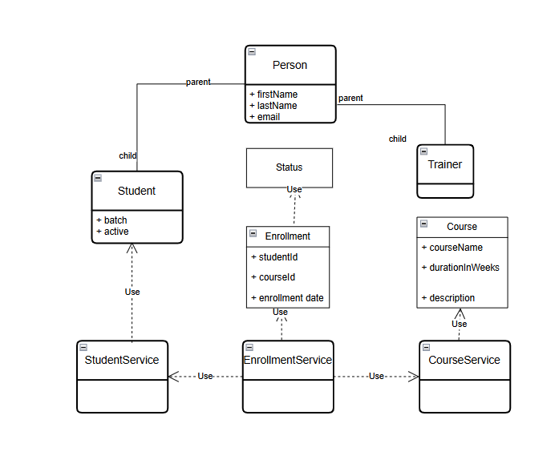

# LearnTrack
Student &amp; Course Management System
Console based student and course management system implemented in Java 25

Here we can add Students, list all students
add courses, activate or de-activate courses
link enrollment with student and courses

import into IDE
Set the JDK to 25
run Main.java

