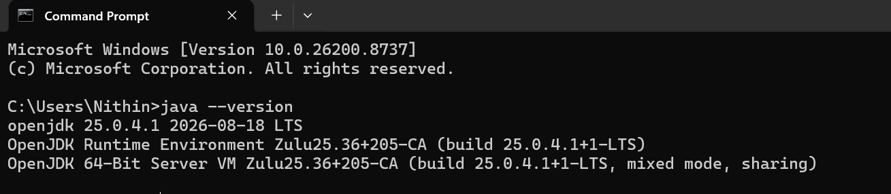
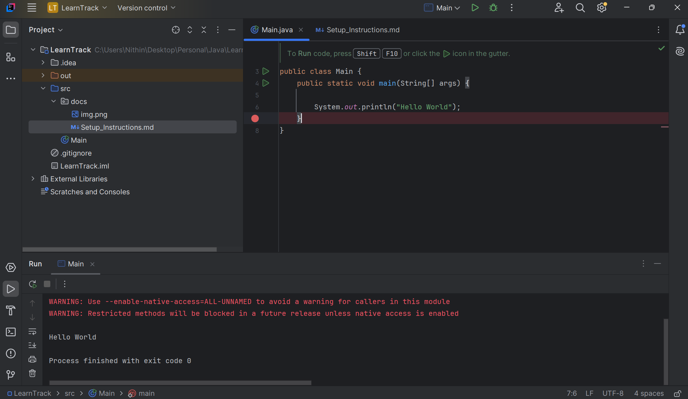

JDK version used : openjdk 25.0.4.1 2026-08-18 LTS

"Hello World" is printed in console of an IDE

Command javac which is part of the JDK converts Main.java file into a byte
code Main.class,command java which is part of JVM converts the byte code
into machine code which the machine understands and returns the output

In JVM memory, what happens initially classloader loads the classes.
It has three parts Application classloader which loads user code specific
classes & third party classes. If there is any classes that cannot be
loaded by Application class loaders it checks with Extension class loader,
where platform classes are loaded. Similarly if Extension class loader has 
dependencies it cannot resolve, moves up to bootstrap class loader where 
java internal classes are loaded. Once all are loaded the control moves down
to the Application class loader. The above process are known as loading phase.

Linking phase
It has three parts verification where the byte code is verified,preparation
assigns memory allocation of static fields & their default values.
Resolution replaces code references of classes with actual memory location.
Initialisation where values are assigned & static fields are executed.

Memory
It has method area, stack & heap memory.
Method area stores class code which is loaded by loading & linking phase.
Stack memory is a stack data structure follows LIFO, which can store method
execution, primitive variables. Each method has it's own frame in the stack
Heap memory is where objects are stored, their memory address is linked in
stack memory if the object's instance is being used.

Execution
Interpreter converts the code line by line.
Compiler which checks for hot paths where if a piece of code runs more than
a specific number then compiler is triggered.

How "Hello World" is printed ?

Main.java is converted to Main.class which is a byte code.
In loading phase Application loader loads Main class, in Main class
there are dependencies it can't resolve. SO moves up to platform then
to Bootstrap which loads java specific classes such as System,String[]
then control moves down to Application class loader.

In linking phases byte code is verified, there are no static fields for
preparation. In resolution System.out, string literal "Hello World" memory
location is used.

Method area stores the class bytecode, main thread has it's own stack where
main methods frame is inserted. Which has a reference of "Hello World" string
pool into the heap.

Interpreter executes the code line by line which prints in the console.

download & install JDK 25, set it to environment variables so it is
accessible everywhere. Link the IDE to JDK and run the Main.java file.